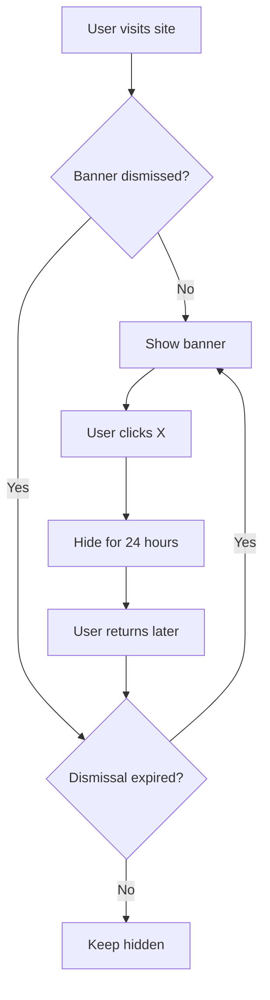

# Campaign Banner Dismissal Configuration

## Overview

The campaign banner now uses **time-based dismissal** instead of permanent dismissal. When users click the X button, the banner is hidden for a configurable duration (default: 24 hours) and then automatically reappears.

## Configuration

### Adjust Dismissal Duration

Edit [/lib/campaign-banner-config.ts](../lib/campaign-banner-config.ts):

```typescript
export const BANNER_CONFIG = {
  DISMISS_DURATION_HOURS: 24, // ← Change this value
}
```

### Common Duration Options

| Duration | Use Case |
|----------|----------|
| `0` | Session only (shows again on next browser session) |
| `6` | Show again after 6 hours (very aggressive) |
| `24` | Show again after 1 day (recommended for urgent campaigns) ⭐ |
| `72` | Show again after 3 days (balanced approach) |
| `168` | Show again after 1 week (less aggressive) |

## How It Works

### User Experience Flow



### Technical Implementation

1. **On Dismiss**: Saves expiration timestamp to localStorage
   ```javascript
   // Stores: "2025-12-12T15:30:00.000Z"
   localStorage.setItem('designworks_class2025_banner_dismissed_until', expirationDate)
   ```

2. **On Page Load**: Checks if current time > expiration time
   ```javascript
   const dismissedUntil = new Date(localStorage.getItem('...'))
   if (new Date() > dismissedUntil) {
     // Show banner
   }
   ```

3. **Automatic Cleanup**: Expired dismissals are automatically removed from localStorage

## Benefits of Time-Based Dismissal

✅ **Increased Visibility**: Banner reappears automatically, increasing campaign reach
✅ **Respectful UX**: Honors user's wish to dismiss, but for a limited time
✅ **Campaign Urgency**: Regular reminders as deadline approaches
✅ **No Admin Action Required**: Automatic reappearance without manual intervention
✅ **Configurable**: Easy to adjust duration based on campaign needs

## Testing & Debugging

### Check Current Dismissal Status

**Browser Console**:
```javascript
const dismissed = localStorage.getItem('designworks_class2025_banner_dismissed_until')
if (dismissed) {
  const expiresAt = new Date(dismissed)
  const hoursRemaining = Math.ceil((expiresAt - new Date()) / (1000 * 60 * 60))
  console.log(`Banner dismissed for ${hoursRemaining} more hours (until ${expiresAt.toLocaleString()})`)
} else {
  console.log('Banner not dismissed')
}
```

### Force Show Banner Immediately

**Option 1 - Console**:
```javascript
localStorage.removeItem('designworks_class2025_banner_dismissed_until');
location.reload();
```

**Option 2 - Use Helper Functions**:
```javascript
// In your code
import { clearBannerDismissal } from '@/lib/campaign-banner-config'
clearBannerDismissal()
```

**Option 3 - Use Reset Script**:
Run [/scripts/reset-banner.js](../scripts/reset-banner.js) in browser console

### Test Dismissal Timing

**Simulate 1 Hour Dismissal (for testing)**:
```javascript
// Temporarily change config
const dismissUntil = new Date()
dismissUntil.setMinutes(dismissUntil.getMinutes() + 1) // 1 minute for testing
localStorage.setItem('designworks_class2025_banner_dismissed_until', dismissUntil.toISOString())
location.reload()
```

## Migration from Permanent Dismissal

The system automatically handles migration from the old permanent dismissal:

**Old System** (permanent):
```javascript
localStorage.getItem('designworks_class2025_banner_dismissed') // returns 'true'
```

**New System** (time-based):
```javascript
localStorage.getItem('designworks_class2025_banner_dismissed_until') // returns ISO date string
```

**Automatic Cleanup**:
- When banner is dismissed with new system, old key is automatically removed
- Helper functions check both keys for backwards compatibility

## Console Debug Messages

The banner logs helpful debug information:

```
🎯 Campaign Banner Debug: {active: "classOf2025", enabled: true, deadline: "2025-12-31T23:59:59Z"}
🔍 Banner dismissal status: {isDismissed: true, hoursRemaining: 18, expiresAt: Date}
❌ Banner dismissed for 18 more hours (until 12/12/2025, 3:30:00 PM)
```

Or when showing:
```
🎯 Campaign Banner Debug: {active: "classOf2025", enabled: true, deadline: "2025-12-31T23:59:59Z"}
🔍 Banner dismissal status: {isDismissed: false}
✅ Showing campaign banner
```

## API Reference

### `campaign-banner-config.ts`

#### `isBannerDismissed()`
Check if banner is currently dismissed.

**Returns**:
```typescript
{
  isDismissed: boolean
  hoursRemaining?: number
  expiresAt?: Date
}
```

**Example**:
```typescript
const status = isBannerDismissed()
if (status.isDismissed) {
  console.log(`Hidden for ${status.hoursRemaining} more hours`)
}
```

#### `dismissBanner()`
Dismiss banner for configured duration.

**Returns**: `Date` (expiration timestamp)

**Example**:
```typescript
const expiresAt = dismissBanner()
console.log(`Dismissed until ${expiresAt.toLocaleString()}`)
```

#### `clearBannerDismissal()`
Clear dismissal state (show banner immediately).

**Example**:
```typescript
clearBannerDismissal()
window.location.reload()
```

#### `getDismissalExpiration()`
Get when current dismissal would expire.

**Returns**: `Date`

**Example**:
```typescript
const expiresAt = getDismissalExpiration()
console.log(`Would expire at: ${expiresAt.toLocaleString()}`)
```

## Common Scenarios

### Scenario 1: Campaign Launch
**Goal**: Maximize visibility for first week
**Configuration**: `DISMISS_DURATION_HOURS: 6`
**Result**: Banner reappears 4x per day

### Scenario 2: Urgent Deadline Approaching
**Goal**: Daily reminders as deadline nears
**Configuration**: `DISMISS_DURATION_HOURS: 24`
**Result**: Banner reappears once per day

### Scenario 3: Long-Running Campaign
**Goal**: Weekly reminders without being annoying
**Configuration**: `DISMISS_DURATION_HOURS: 168`
**Result**: Banner reappears once per week

### Scenario 4: Testing/Development
**Goal**: Never persist dismissal
**Configuration**: `DISMISS_DURATION_HOURS: 0`
**Result**: Banner reappears every new session

## Best Practices

1. **Match Campaign Urgency**: More urgent campaigns = shorter dismissal duration
2. **Consider User Experience**: Balance visibility with annoyance factor
3. **Test Different Durations**: A/B test to find optimal reappearance rate
4. **Monitor Dismissal Rate**: High dismissal rate = adjust duration or messaging
5. **Use Debug Logging**: Keep debug logs enabled to troubleshoot issues

## Troubleshooting

### Banner Not Reappearing

**Check**:
1. Is `DISMISS_DURATION_HOURS` set to 0 or a very large number?
2. Run debug script to check actual dismissal timestamp
3. Verify system clock is correct on user's machine

**Fix**:
```javascript
// In console
const dismissed = localStorage.getItem('designworks_class2025_banner_dismissed_until')
console.log('Dismissed until:', new Date(dismissed))
// If date looks wrong, clear it:
localStorage.removeItem('designworks_class2025_banner_dismissed_until')
```

### Banner Reappearing Too Frequently

**Check**: `DISMISS_DURATION_HOURS` value in config

**Fix**: Increase duration in [campaign-banner-config.ts](../lib/campaign-banner-config.ts)

### Banner Never Dismissing

**Check**:
1. Console errors blocking dismiss handler
2. LocalStorage quota exceeded
3. Browser blocking localStorage

**Fix**: Check browser console for errors

## Related Files

- [/lib/campaign-banner-config.ts](../lib/campaign-banner-config.ts) - Configuration & helpers
- [/components/StickyCountdownBanner.tsx](../components/StickyCountdownBanner.tsx) - Banner component
- [/scripts/reset-banner.js](../scripts/reset-banner.js) - Reset utility
- [/docs/CAMPAIGN-BANNER-DEBUG.md](./CAMPAIGN-BANNER-DEBUG.md) - Debug guide
