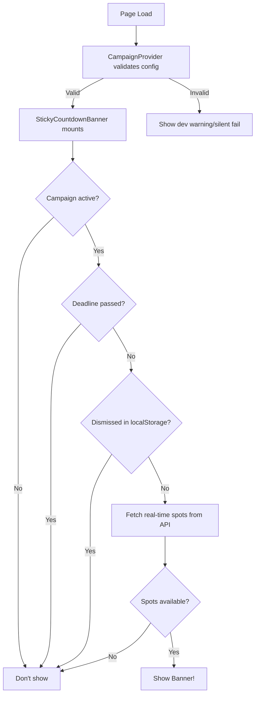

# Campaign Banner Debugging Guide

## Overview

The sticky countdown banner for "Class of 2025" campaign is managed through a multi-layer system:

1. **Campaign Configuration**: `/data/activeCampaign.json`
2. **Campaign Provider**: `/components/CampaignProvider.tsx`
3. **Banner Component**: `/components/StickyCountdownBanner.tsx`
4. **API Endpoint**: `/app/api/campaign/spots/route.ts`
5. **Validation Logic**: `/lib/validate-campaign.ts`

## Why Banner Might Not Display

### 1. Campaign Configuration Issues

**Check**: `/data/activeCampaign.json`

Required conditions:
- `"active": "classOf2025"` ✓
- `classOf2025.enabled: true` ✓
- `classOf2025.deadline` must be in the future ✓
- Valid `stripePriceId` present ✓

**Current Status**: All configuration is correct ✓

### 2. LocalStorage Dismissal (MOST LIKELY ISSUE)

**Problem**: If a user clicks the X button to dismiss the banner, it's stored in localStorage and won't show again.

**LocalStorage Key**: `designworks_class2025_banner_dismissed`

**Check in Console**:
```javascript
localStorage.getItem('designworks_class2025_banner_dismissed')
// Returns: 'true' if dismissed, null if not dismissed
```

**Fix**: Clear the dismissed state:
```javascript
localStorage.removeItem('designworks_class2025_banner_dismissed');
window.location.reload();
```

**Or use the reset script**:
```bash
# Open browser console and paste contents of:
/scripts/reset-banner.js
```

### 3. Campaign Validation Errors

**Check Console**: Look for messages starting with:
- `🔧 CampaignProvider validation:` - Shows validation status
- `❌ Campaign configuration errors:` - Shows specific errors

**Fix**: Address any validation errors shown in the console.

### 4. Deadline Passed

**Check**: Is the deadline in the past?

Current deadline: `2025-12-31T23:59:59Z`

**Console message**: `❌ Campaign deadline has passed`

**Fix**: Update deadline in `/data/activeCampaign.json` if needed (currently valid until Dec 31, 2025)

### 5. Campaign Not Active

**Check Console**: Look for:
- `❌ Campaign not active or not enabled`

**Current Status**: Campaign IS active ✓

## Debugging Steps

### Step 1: Check Console Logs

Open browser console and look for these debug messages:

```
🔧 CampaignProvider validation: {valid: true, errors: [], active: "classOf2025"}
🎯 Campaign Banner Debug: {active: "classOf2025", enabled: true, deadline: "2025-12-31T23:59:59Z"}
🔍 Banner dismissed status: null
✅ Showing campaign banner
```

### Step 2: Check LocalStorage

In console:
```javascript
localStorage.getItem('designworks_class2025_banner_dismissed')
```

If it returns `"true"`, the banner was dismissed. Clear it:
```javascript
localStorage.removeItem('designworks_class2025_banner_dismissed');
location.reload();
```

### Step 3: Verify API Endpoint

Test the spots API:
```bash
curl 'http://localhost:3000/api/campaign/spots?campaign=classOf2025' | jq
```

Expected response:
```json
{
  "available": true,
  "spotsRemaining": 10,
  "totalSpots": 10,
  "activeSubscriptions": 0,
  "deadline": "2025-12-31T23:59:59Z",
  "deadlinePassed": false,
  "priceId": "price_1Sc4O7P3PqPfy1jMzrqN0O7L",
  "message": "10 spots remaining"
}
```

### Step 4: Check Network Tab

1. Open DevTools → Network tab
2. Filter by "campaign"
3. Refresh page
4. Look for request to `/api/campaign/spots?campaign=classOf2025`
5. Check if it returns 200 OK with proper data

## Quick Fixes

### Force Banner to Show (Development Only)

Temporarily comment out localStorage check in `/components/StickyCountdownBanner.tsx`:

```typescript
// const dismissed = localStorage.getItem('designworks_class2025_banner_dismissed')
// if (dismissed === 'true') {
//   return
// }
```

### Reset All Campaign State

```javascript
// In browser console:
Object.keys(localStorage)
  .filter(key => key.includes('designworks') || key.includes('campaign'))
  .forEach(key => localStorage.removeItem(key));
location.reload();
```

## Banner Component Flow



## File Structure

```
Campaign Banner System
├── Data & Config
│   ├── /data/activeCampaign.json          # Campaign configuration
│   └── /types/campaign.ts                 # TypeScript types
├── Components
│   ├── /components/CampaignProvider.tsx   # Validates and provides campaign context
│   ├── /components/StickyCountdownBanner.tsx  # Banner UI and logic
│   └── /components/CampaignErrorBoundary.tsx  # Error handling
├── API
│   └── /app/api/campaign/spots/route.ts  # Real-time spots from Stripe
├── Utilities
│   ├── /lib/validate-campaign.ts          # Validation logic
│   └── /hooks/useCampaignSpots.ts        # React hook for spots data
└── Scripts
    └── /scripts/reset-banner.js          # Reset dismissed state
```

## Common Issues & Solutions

| Issue | Symptom | Solution |
|-------|---------|----------|
| Banner was dismissed | No banner visible | Clear localStorage key |
| Validation failing | Console shows errors | Fix config in activeCampaign.json |
| API not responding | Network error in console | Check Stripe API keys in .env.local |
| Wrong spots count | Banner shows incorrect numbers | API pulling from Stripe subscriptions |
| Banner not sticky | Banner scrolls away | Check z-index and position:sticky styles |

## Environment Variables Required

```bash
# .env.local
STRIPE_SECRET_KEY=sk_...
NEXT_PUBLIC_STRIPE_PUBLISHABLE_KEY=pk_...
STRIPE_WEBHOOK_SECRET=whsec_...
```

## Testing Checklist

- [ ] Check console for debug messages
- [ ] Verify localStorage is clear
- [ ] Test API endpoint returns valid data
- [ ] Confirm campaign deadline is in future
- [ ] Verify `active: "classOf2025"` in config
- [ ] Confirm `enabled: true` in config
- [ ] Check network tab for API calls
- [ ] Test dismiss functionality
- [ ] Test countdown timer updates
- [ ] Verify spots counter decreases with subscriptions
- [ ] Test hover animations
- [ ] Check mobile responsiveness

## Contact

If issues persist after following this guide, check:
1. Browser console for detailed error messages
2. Network tab for failed API requests
3. Server logs for API endpoint errors
